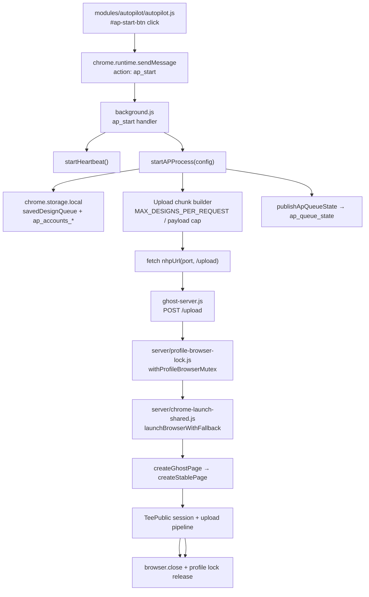

# Ghost Server Stability Report
**Date:** 2026-06-25  
**Scope:** AUT → Ghost Server automation runtime only  
**Compared:** CURRENT (`NHP_V30.1_Production_Build`) vs OLD stable backup (`NHP_V30.1_Production_Build_BACKUP_2026-04-07`)

---

## Executive Summary

The primary instability root cause is a **regression in `/upload` browser teardown** in `ghost-server.js`: the `finally` block attempted `browser.close()` only when the browser was **already disconnected** (`!browser.isConnected()`), so successful uploads left Chrome profiles open. That caused profile lock contention, mutex timeouts, failed follow-up chunks/accounts, and memory growth.

A secondary bug was **`const page` reassignment** during page-recovery in the upload loop, which throws `TypeError: Assignment to constant variable` when recovery paths run.

Two localized patches were applied to CURRENT only. All new features (queue monitor, chunking, retry, profile mutex, stealth launch, foundation flow, etc.) were preserved.

---

## 1. Dependency Graph

### Click flow: AUT → Start via Ghost Server



### Supporting paths (unchanged scope, new in CURRENT)

| Path | Entry | Backend |
|------|--------|---------|
| Wake server | `#ap-wakeup-btn` → `wake_server` | `background.js` → `controlGhostServerProcess` / protocol |
| Open account browser | `.open-ap-browser-btn` → `open_account_browser` | `background.js` → `launchExternalAccountBrowser` → `POST /browse-account` |
| Retry failed | `#ap-retry-failed-btn` → `ap_retry_failed` | `buildApFailedRetryConfig` → `startAPProcess` |
| Queue monitor | `ap_get_queue_state` / `ap_queue_state` | `AP_UPLOAD_QUEUE_STATE_KEY` in storage |
| Stop | `ap_stop` | `apStopped = true` + optional `/shutdown` |

---

## 2. File Inventory

### 2.1 Files only in OLD backup (Ghost-relevant)

| File | Role |
|------|------|
| `ghost-server.js` (~252 lines) | Monolithic upload server: `/upload`, `/ping`, `/shutdown` |
| `server.js` | Legacy port 3009 API proxy (not Ghost automation) |
| `start_nhp_server.vbs`, `RESTART_SERVER.bat` | Old launcher helpers |

### 2.2 Files only in CURRENT (Ghost-relevant)

| File | Role |
|------|------|
| `server/profile-browser-lock.js` | Per-email mutex + Chrome singleton cleanup |
| `server/chrome-launch-shared.js` | Launch fallback, arg sanitization |
| `server/browser-stealth-profile.js` | Stealth helpers |
| `server/generate-api.js`, `server/library-smart-rename.js` | Mounted on Ghost port (non-upload) |
| `server/nhp-ai-supervisor.js` | Upload supervision hooks |
| `Start_Ghost_Server_*.cmd/.ps1/.vbs`, `Restart_Ghost_3019.*` | Ghost launcher suite |
| `NHP_Start_Ghost_On_Port.ps1` | Port-aware bootstrap |

### 2.3 Modified shared files (runtime impact)

| File | OLD | CURRENT | Impact |
|------|-----|---------|--------|
| `ghost-server.js` | 252 lines, inline Puppeteer | 3349 lines, modular pipeline | **High** — main runtime |
| `background.js` | ~1290 lines, simple `startAPProcess` | ~12184 lines, chunking + queue state | **High** — orchestration |
| `modules/autopilot/autopilot.js` | Basic start/stop/wake | Queue monitor, retry, server monitor, Pinterest split | **Medium** — UI triggers only |

---

## 3. Runtime Comparison (OLD vs CURRENT)

| Area | OLD (stable) | CURRENT (before patch) | Risk |
|------|--------------|------------------------|------|
| **Server startup** | Fixed port 3019, single process | `NHP_GHOST_PORT` env, Generate API mount, `/status` | Low if port known |
| **ap_start** | Direct `startAPProcess(req.data)` | Merges `ap_last_start_config`, clears queue cache | Low |
| **Queue processing** | Sequential accounts, one HTTP request per account | Chunking (max 5 designs, 110MB cap), 12s inter-chunk delay | Medium — depends on browser close |
| **Browser launch** | `puppeteer.launch` inline | `launchBrowserWithFallback` + profile lock retry | Medium — better when close works |
| **Page creation** | First page from `browser.pages()[0]` | `createStablePage` + stealth patch | Low |
| **Upload sequencing** | Simple for-loop, 6s after file upload | Attempt loop (×2), observation hooks, surface inspect | Medium complexity |
| **Auth** | Inline login on sign_in | `ensureTeePublicSession` | New feature — kept |
| **Publish** | `waitForSelector` + click | `waitForFunction` + evaluate click + `Promise.race` confirmation | New — kept |
| **Browser close** | `if (browser && !keepAlive) close after 6s` | **BUG:** `if (!browser.isConnected()) close` | **Critical** |
| **Profile lock** | None | `withProfileBrowserMutex` + Singleton files | **Critical** when Chrome left open |
| **Retry** | None | Per-design results + `ap_retry_failed` | New — kept |
| **Heartbeat** | Basic | Offscreen doc + port ping | New — kept |
| **IPC timeout** | 60 min AbortController | Same | OK |
| **Shutdown** | `/shutdown` | `/shutdown` + `/api/ghost/restart` | New — kept |

---

## 4. Root Cause Analysis

### 4.1 Primary: Inverted browser close condition (CRITICAL)

**Location:** `ghost-server.js` → `POST /upload` → `finally` block  

**Regression introduced:** Between `ghost-window-close-fix_20260622_073105` (correct) and `observation-loop-recovery` (broken).

```javascript
// BROKEN (CURRENT before fix)
if (browser && !browser.isConnected()) {
    await browser.close();
}

// STABLE (OLD + window-close-fix backup)
if (browser && !keepAlive) {
    await delay(6000);
    await browser.close();
}
```

**Effect chain:**
1. Upload completes successfully; Chrome stays open with `userDataDir` locked.
2. `withProfileBrowserMutex` releases JS lock file, but Chrome `SingletonLock` remains.
3. Next chunk (12s later) or next account → `launchBrowserWithFallback` fails or times out.
4. Background logs: fetch errors, mutex timeout, "browser already running".
5. Zombie Chrome processes accumulate → RAM pressure on weak PCs.

This matches intermittent failures that clear after manual Ghost restart or killing Chrome.

### 4.2 Secondary: `const page` reassignment (HIGH)

**Location:** `ghost-server.js` line ~2529 (upload handler)

Recovery paths assign `page = await getOrRecoverTeePublicPage(browser)` while `page` was declared `const`. In Node strict mode this throws and aborts the upload mid-loop.

### 4.3 Non-issues (kept as-is)

- Chunking / 12s inter-chunk delay — correct design **if** browser closes between chunks.
- `ensureGhostServerReady` not called from `ap_start` — same as OLD (user wakes server via `#ap-wakeup-btn`).
- Expanded TeePublic selectors and publish confirmation — intentional new behavior.

---

## 5. Missing Logic (extracted from stable, now restored)

| Stable behavior | Was missing in CURRENT | Patch |
|-----------------|------------------------|-------|
| Close browser when `!keepAlive` after upload | Yes | **Applied** |
| 6s settle delay before close | Yes (was 1s on dead browser only) | **Applied** |
| 2.5s post-close delay | Yes | **Applied** |
| Profile lock cleanup after session | Partial | **Applied** via `releaseProfileLockForEmail` |
| Mutable `page` for recovery | Broken (`const`) | **Applied** (`let page`) |

---

## 6. Safer Implementation (post-patch)

```javascript
} finally {
    clearActiveUploadJob(currentJobId);
    if (browser && !keepAlive) {
        await new Promise(r => setTimeout(r, 6000));
        if (browser.isConnected()) {
            await browser.close().catch(...);
        }
        await releaseProfileLockForEmail(uploadEmail).catch(...);
        await new Promise(r => setTimeout(r, 2500));
    }
    if (!res.headersSent) {
        res.status(responsePayload.statusCode).json(responsePayload.body);
    }
}
```

Aligns with:
- OLD `ghost-server.js` finally semantics
- `apply-store-profile` handler in CURRENT (`!keepAlive` close)
- `ghost-window-close-fix_20260622_073105` backup

---

## 7. Localized Patches APPLIED

| # | File | Change | Reason |
|---|------|--------|--------|
| 1 | `ghost-server.js` | Restore `!keepAlive` browser teardown + `releaseProfileLockForEmail` + timing | Fix zombie Chrome / profile locks |
| 2 | `ghost-server.js` | `const page` → `let page` in `/upload` | Fix recovery TypeError |

**Not modified (per scope):** UI layout, storage keys, schema, Search/Studio/Marketplace modules, manifest permissions.

---

## 8. Modified File List

- `ghost-server.js` (2 localized edits)
- `GHOST_SERVER_STABILITY_REPORT.md` (this file)

---

## 9. Validation

| Check | Result |
|-------|--------|
| `node --check ghost-server.js` | ✅ Pass |
| `node --check server/profile-browser-lock.js` | ✅ Pass |
| ESLint / TypeScript | N/A (no project-wide lint script for servers) |
| `npm run smoke` | Not run (requires live servers) |

### Manual test plan

1. Wake Ghost Server (`#ap-wakeup-btn`) → `/ping` OK on port 3019.
2. Queue 2+ designs, 1 account, start AUT → verify upload completes.
3. **Critical:** After upload, confirm no leftover `chrome.exe` for `server_profiles/<email>` (Task Manager).
4. Multi-design (>5) or large payloads → multiple chunks; second chunk must succeed without restart.
5. Multi-account run → second account must launch cleanly.
6. Auth failure → browser stays open (`keepAlive`), user can log in manually.
7. Retry failed → only failed items re-run.
8. New features smoke: queue monitor updates, visual mode, foundation entry (if used).

---

## 10. New Features Confirmed Intact

- Upload chunking and payload size guards (`background.js`)
- Per-design result tracking + `ap_retry_failed`
- Queue monitor state (`AP_UPLOAD_QUEUE_STATE_KEY`)
- Profile browser mutex (`server/profile-browser-lock.js`)
- Chrome launch fallback (`server/chrome-launch-shared.js`)
- `ensureTeePublicSession`, foundation entry, store profile apply
- Observation logging (`[OBSERVE]` frames)
- Per-design retry loop (×2 attempts)
- Generate API / niche memory routes on Ghost port
- Pinterest vs Ghost platform split in autopilot UI
- Server monitor + wake/stop controls

---

## 11. Recommended Follow-ups (optional, not applied)

1. Add integration test script that mocks `/upload` and asserts `browser.close` is called when `keepAlive=false`.
2. Log explicit `[UploadTeardown]` line when close succeeds — aids log diagnosis.
3. Consider calling `ensureGhostServerReady()` at `startAPProcess` entry (UX improvement; OLD did not auto-wake).

---

## Phase 2 — Full Ghost Server Diff Analysis

**Date:** 2026-06-25  
**Full report:** See `GHOST_SERVER_DIFF_ANALYSIS.md`

### Files compared

| Category | OLD only | CURRENT only | Shared (diffed) |
|----------|----------|--------------|-----------------|
| Core server | `ghost-server.js` (252 lines) | `server/*.js` (8 modules), 9 launcher scripts | `ghost-server.js` (3,355 lines) |
| Orchestration | — | `ensureGhostServerReady`, chunking, queue state | `background.js` |
| UI triggers | — | queue monitor, retry-failed, server monitor | `modules/autopilot/autopilot.js` |

### Key remaining diffs (stability-focused)

| Category | OLD | CURRENT | Risk |
|----------|-----|---------|------|
| Browser Lifecycle | `!keepAlive` → 6s → `close()` | Same **+** `releaseProfileLockForEmail` + connected check | **Fixed** |
| Queue | Single request/account | Chunks (≤5, 110MB) + 12s inter-chunk delay | OK if close works |
| Upload | 6s post-file, simple publish | `waitForTeePublicUploadCommit` + 2-attempt loop + page recovery | Enhanced |
| Retry | None | Server ×2 + `ap_retry_failed` | New feature |
| Session/Profile | No mutex | `withProfileBrowserMutex` + lock files | Needs clean teardown |

### Open items (non-critical)

1. `/apply-store-profile` — missing `releaseProfileLockForEmail` in `finally` (low severity)
2. Remote-debug browser reuse on same port — edge case if prior session zombie
3. Optional: `[UploadTeardown]` log line for diagnostics

### Patches applied in Phase 2

**None.** Phase 1 fixes (`!keepAlive` teardown, `let page`) verified present. No new critical regressions found.

### Stress test checklist (manual)

| Test | Focus |
|------|-------|
| **Single Upload** | 1 design → success → no zombie Chrome |
| **Sequential Upload** | 6+ designs → multi-chunk → all chunks without restart |
| **Restart Test** | Mid-run Ghost restart → recovery on re-wake |
| **Queue Stress** | 2+ accounts → second account launches clean |
| **Failure Recovery** | Auth fail (keepAlive), retry-failed, visual mode |

Detailed steps in `GHOST_SERVER_DIFF_ANALYSIS.md` §7.

---

## Phase 3 — Optional Patches Applied

**Date:** 2026-06-25

| # | File | Change |
|---|------|--------|
| 1 | `ghost-server.js` `/apply-store-profile` | `releaseProfileLockForEmail(profileEmail)` in `finally` after `gracefulCloseGhostBrowser` (parity with `/upload`) |
| 2 | `ghost-server.js` `/upload` | `[UploadTeardown] Browser closed successfully for {email}` when `!browser.isConnected()` after teardown |
| 3 | `background.js` `startAPProcess` | `await ensureGhostServerReady()` at entry — auto-wake Ghost before first chunk |

**Retest:** Single upload (check Ghost log for `[UploadTeardown]`), store-profile apply (no zombie Chrome / lock file), AP start without manual wake button.

---

*Report generated by stability comparison workflow. Patches are minimal and backward-compatible.*
