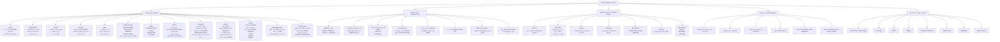

# NHP Extension Functions Diagram

هذا الملف يوفر خطاطة جاهزة للنسخ بصيغة Mermaid.
يمكنك نسخ الكود كاملًا أو فتح ملف الصورة المرافق:
`docs/nhp_extension_functions_diagram.svg`

```mermaid
flowchart TD
    N["Niche Hunter Pro v30.1"]

    N --> UI["واجهة الإضافة Popup"]
    N --> BG["خدمات الخلفية background.js"]
    N --> CS["الحقن داخل المواقع Content Scripts"]
    N --> GS["الخادم المحلي Ghost Server"]
    N --> EXT["الخدمات والمنصات الخارجية"]

    UI --> T0["Trends\nجلب ترندات TeePublic\nتحليل AI\nتشغيل المسار الكامل"]
    UI --> T1["TMHunt Bulk\nفحص جماعي للنِّتشات\nتصنيف آمن أو مقيّد\nتصدير النتائج"]
    UI --> T2["USPTO\nفحص العلامات التجارية\nآمن أو محظور\nنقل وتصدير"]
    UI --> T3["Analysis\nتحليل منافسة TeePublic\nممتاز أو متوسط أو مشبع أو غير معروف"]
    UI --> T4["Note\nمفكرة النِّتشات\nبحث وسجل تاريخي\nاستيراد وتصدير"]
    UI --> T5["Studio Pipeline\nGemini Designer\nPeel Banana\nTeeMaster\nSmart Renamer\nلقطات شاشة وتسجيل ورسم"]
    UI --> T6["Radar\nRising Star Scan\nHunter\nRelated Tags\nAI Insights"]
    UI --> T7["SEO AI\nرفع جماعي\nتوليد Title Tags Description\nتدقيق جمالي\nتطبيق جماعي\nرفع تلقائي إلى TeePublic"]
    UI --> T8["Autopilot\nطابور التصاميم\nألبومات ومجموعات\nإدارة حسابات TeePublic Redbubble Amazon\nحصص يومية وبروكسي ورفع متعدد"]
    UI --> T9["Admin\nتسجيل دخول\nمزامنة GitHub ومحلية\nWorkspace\nمكتبة التصاميم\nأدوات تشغيل سريعة\nتفعيل مراحل Pipeline"]
    UI --> T10["Social\nإعدادات Facebook\nتوليد منشور AI\nنشر على Facebook وPinterest\nUI Bot\nAI Agent\nAI Pilot"]
    UI --> T11["Redbubble Hub\nقراءة طابور SEO المشترك\nتحرير بيانات RB\nفتح مدير الرفع والإحصاءات"]
    UI --> T12["Amazon Hub\nقراءة طابور SEO المشترك\nتحرير بيانات Amazon\nفتح مدير الرفع\nNormal Pro Filters BSR"]

    BG --> B1["Pipeline تلقائي\nTrends -> TMHunt -> USPTO -> TeePublic"]
    BG --> B2["ذاكرة النِّتشات والأرشيف\nاسترجاع النتائج السابقة\nSnapshots يومية"]
    BG --> B3["أوامر واختصارات الشاشة\nVisible\nSelected\nFull Page"]
    BG --> B4["Context Menu\nإرسال صورة إلى Gemini\nتشغيل Screen Recorder"]
    BG --> B5["اعتراض تنزيلات Gemini\nإرسال الصور تلقائيًا إلى Studio"]
    BG --> B6["نشر عبر Facebook Graph API"]
    BG --> B7["Offscreen capture\nقص وتجميع لقطات الصفحة الكاملة"]
    BG --> B8["تشغيل ونداء Ghost Server\nوإدارة رفع المنصات"]

    CS --> C1["USPTO\nتجهيز الصفحة وقراءة نتيجة الفحص"]
    CS --> C2["TeePublic\nتعبئة نموذج الرفع\nتسجيل دخول\nمؤشر تقدم مباشر"]
    CS --> C3["Gemini\nاستقبال الصور والبرومبتات التلقائية"]
    CS --> C4["Facebook\nأتمتة التفاعل والنشر من الواجهة"]
    CS --> C5["SEO Artisan\nGoogle Pinterest Etsy TeePublic"]
    CS --> C6["TMHunt\nتكامل فحص داخل الموقع"]
    CS --> C7["MerchGhost\nAmazon\nRedbubble\nTeePublic"]

    GS --> G1["إدارة بروفايلات المتصفحات لكل حساب"]
    GS --> G2["رفع تلقائي محلي للمنصات"]
    GS --> G3["نسخ احتياطي واستعادة Sessions"]
    GS --> G4["حفظ niche memory"]
    GS --> G5["حفظ niche archive و trend snapshots"]
    GS --> G6["Logs و metadata_store و server_profiles"]

    EXT --> E1["Gemini API و Gemini Web"]
    EXT --> E2["TeePublic"]
    EXT --> E3["USPTO"]
    EXT --> E4["TMHunt"]
    EXT --> E5["Facebook Graph API"]
    EXT --> E6["GitHub Sync"]
    EXT --> E7["Redbubble"]
    EXT --> E8["Amazon Merch"]
```
