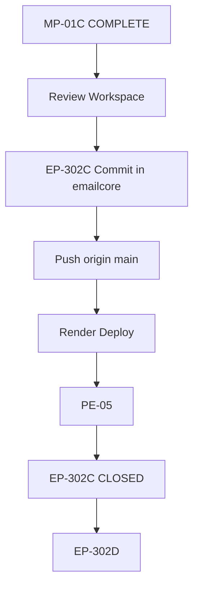

# MP-01C — EP-302C Post-Sequence (Approved)

**Task:** MP-01C (parallel documentation track)  
**Generated:** 2026-07-07 (UTC+1)  
**Status:** `APPROVED_SEQUENCE` — CA / MB-03 aligned  
**Inputs:** `MP01B_REPOSITORY_ARCHITECTURE.md` § EP-302C, AR-09, `MP01C_MIGRATION_REPORT.md`

---

## Rule — nothing before MP-01C COMPLETE

EP-302C commit, push, Render deploy, and PE-05 are **blocked** until MP-01C migration gates pass and workspace paths are canonical.

| Action | Before MP-01C | After MP-01C COMPLETE |
|--------|---------------|------------------------|
| Commit EP-302C in emailcore | ❌ HOLD | ✅ Step 2 |
| Push to `maggouri/emailcore` | ❌ HOLD | ✅ Step 3 |
| Render deploy | ❌ HOLD | ✅ Step 4 |
| PE-05 retest | ❌ HOLD | ✅ Step 5 |
| EP-302D start | ❌ HOLD | ✅ Step 7 only |

---

## Approved sequence (ordered)

```text
MP-01C COMPLETE
    │
    ▼
Review Workspace          ← CA / operator verification
    │
    ▼
EP-302C Commit            ← in emailcore repo (01_EmailCore/)
    │
    ▼
Push                      ← origin main (user authorization)
    │
    ▼
Render Deploy             ← render.yaml service
    │
    ▼
PE-05                     ← hosted admin retest
    │
    ▼
EP-302C CLOSED
    │
    ▼
EP-302D                   ← next pack (not before EP-302C CLOSED)
```

---

## Step details

### Step 0 — MP-01C COMPLETE

**Exit criteria:**

| Check | Expected |
|-------|----------|
| EmailCore at `NHP_PLATFORM/01_EmailCore/` | `.git` preserved; `origin` → `maggouri/emailcore` |
| 10 EP-302C porcelain files | Unchanged count in `01_EmailCore/` |
| Path updates | `sync-to-emailcore.js`, `ep302c-domain-admin-ui.test.js`, `.env.example` |
| Tests | EP-302 suite PASS (42/42 per migration report) |
| No remote changes | Per `MP01C_REMOTE_POLICY.md` |
| Migration report | `MP01C_MIGRATION_REPORT.md` published |

**Status note:** MP-01C may be `PARTIAL` (Phase 2 extension move deferred) — sequence still valid if EmailCore path and tests are canonical.

---

### Step 1 — Review Workspace

**Owner:** CA / operator  
**Purpose:** Confirm migration artifacts before any git push to hosted repo.

| Review item | Command / path |
|-------------|----------------|
| EmailCore git status | `git -C NHP_PLATFORM/01_EmailCore status --short` → expect 10 EP-302C lines |
| EmailCore remote | `git -C NHP_PLATFORM/01_EmailCore remote -v` |
| Admin UI files | `NHP_PLATFORM/01_EmailCore/public/admin/` |
| Local tests | `node --test scripts/tests/ep302c-domain-admin-ui.test.js` |
| PROJECT_MAP | `NHP_PLATFORM/PROJECT_MAP.md` |
| AR-09 compliance | Single admin surface = EmailCore Web Admin |
| Creaty API (local) | `creaty-server.js` :3020 + `server_logs/mailbox-lifecycle-domains.json` |

**Gate:** CA sign-off on workspace review checklist (`MP01C_DELIVERABLES_CHECKLIST.md`).

---

### Step 2 — EP-302C Commit (emailcore repo)

**Repo:** `NHP_PLATFORM/01_EmailCore/` only — **not** workspace root.

```powershell
git -C NHP_PLATFORM\01_EmailCore status --short
git -C NHP_PLATFORM\01_EmailCore add public/admin/   # + any other EP-302C files per review
git -C NHP_PLATFORM\01_EmailCore commit -m "feat(admin): EP-302C domain registry web admin"
```

| Constraint | Detail |
|------------|--------|
| Authorization | User must explicitly authorize commit |
| Scope | EP-302C files only — no unrelated WIP |
| Branch | `main` (Render default) |

**Domain registry APIs** remain on Creaty `:3020` in extension tree (AR-09 thin-client) — separate from EmailCore admin shell commit.

---

### Step 3 — Push

```powershell
git -C NHP_PLATFORM\01_EmailCore push origin main
```

| Constraint | Detail |
|------------|--------|
| Authorization | User must explicitly request push |
| Repo | `maggouri/emailcore` only |
| Production_Build | **No push** — no remote exists |

---

### Step 4 — Render Deploy

| Item | Detail |
|------|--------|
| Trigger | Push to `main` or manual deploy in Render dashboard |
| Config | `NHP_PLATFORM/01_EmailCore/render.yaml` |
| Target | `https://emailcore.app` |
| Smoke | Admin shell loads; `#domain-registry` route reachable |

**Change window:** Deploy only after Step 2 commit is pushed — avoids hosting stale admin path.

---

### Step 5 — PE-05

**Purpose:** Downstream quality pack — hosted admin canonical verification.

| Test surface | URL / check |
|--------------|-------------|
| Hosted admin | `https://emailcore.app/admin#domain-registry` |
| Domain registry UI | EP-302C admin features per planning docs |
| Thin-client bridge | Creaty `:3020` API reachable from operator machine if required by PE-05 checklist |
| Regression | EP-302C regression doc: `EP302C_REGRESSION.md` |

**Exit:** PE-05 PASS → proceed to Step 6.

---

### Step 6 — EP-302C CLOSED

| Field | Value |
|-------|-------|
| Pack status | CLOSED |
| Evidence | PE-05 report + deploy confirmation |
| Planning docs | Update `EP302C_*` status fields |

---

### Step 7 — EP-302D

**Prerequisite:** EP-302C **CLOSED** only.

| Rule | Detail |
|------|--------|
| Start EP-302D | Only after Step 6 |
| Do not start early | Explicit HOLD in migration report and AR-09 changelog |

Refer to `EP302_PACK_BREAKDOWN.md` and `EP302_EXECUTION_PLAN.md` for EP-302D scope.

---

## Dependency diagram



---

## What stays local (unchanged by sequence)

| Component | Location | Deploy |
|-----------|----------|--------|
| Chrome Extension | Workspace root (Phase 2 → `02_Chrome_Extension/`) | Unpacked load — local |
| Creaty / Ghost / AI bridge | Workspace root servers | Local PM2 / dev |
| Domain registry JSON | `server_logs/mailbox-lifecycle-domains.json` | Local filesystem |
| NHP_Runtime | `E:\NHP_Runtime` | Never in git |

---

## References

- AR-09: Single Source of Administration — EmailCore Web Admin SSOT
- EP-302C planning: `EP302C_SCOPE_REVIEW.md`, `EP302C_UI_REVIEW.md`, `EP302C_REGRESSION.md`
- Remote policy: `MP01C_REMOTE_POLICY.md`
- Deliverables: `MP01C_DELIVERABLES_CHECKLIST.md`

---

## ملخص عربي — Arabic summary

**التسلسل المعتمد بعد MP-01C:**

1. **MP-01C COMPLETE** — نقل EmailCore إلى `01_EmailCore/` وتحديث المسارات.
2. **Review Workspace** — مراجعة CA للمساحة والاختبارات.
3. **EP-302C Commit** — في repo `maggouri/emailcore` فقط.
4. **Push** — بإذن صريح من المستخدم.
5. **Render Deploy** — نشر `emailcore.app`.
6. **PE-05** — اختبار الإدارة المستضافة.
7. **EP-302C CLOSED** — ثم **EP-302D**.

**ممنوع:** أي commit أو push أو deploy قبل اكتمال MP-01C.

---

*End of approved post-sequence.*
